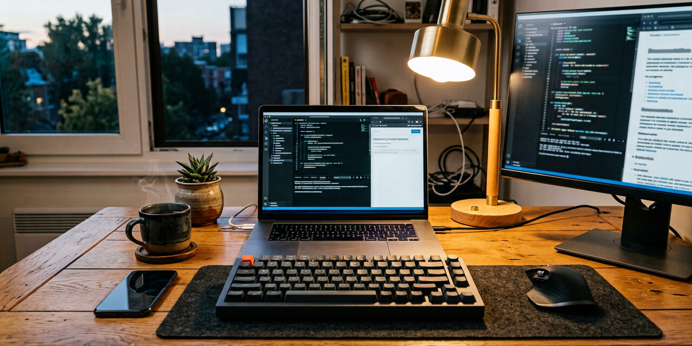

### Hi there 👋



<sub>Banner above: rendered with the iPhone 11 Pro Max wide-camera profile (26mm equiv, f/1.8, 1/120s, ISO 64, Smart HDR). EXIF is embedded in the file — open it in Preview/Photos and press ⌘I.</sub>

---

## iPhone 11 Pro Max image pipeline

`tools/iphone11pro.py` takes any image — including a reference photo — and writes out a copy carrying the **real** capture metadata of an iPhone 11 Pro Max. Not random numbers: every preset maps to the hardware Apple actually shipped.

| Preset | Module | 35mm equiv | Real focal | Aperture |
|---|---|---|---|---|
| `wide` | Main wide | 26 mm | 4.25 mm | f/1.8 |
| `ultrawide` | Ultra wide (120° FOV) | 13 mm | 1.54 mm | f/2.4 |
| `tele` | Telephoto / 2× | 52 mm | 6.00 mm | f/2.0 |
| `portrait` | Telephoto, Portrait mode | 52 mm | 6.00 mm | f/2.0 |
| `night` | Wide, Night mode | 26 mm | 4.25 mm | f/1.8 |

Written into the file: Make/Model (`Apple` / `iPhone 11 Pro Max`), LensMake/LensModel, focal length + 35mm equivalent, aperture, shutter speed, ISO, APEX shutter/aperture/brightness values, metering mode, flash, white balance, colour space, capture timestamp, pixel dimensions.

### Setup

```bash
sudo apt install imagemagick      # cropping + JPEG conversion
pip install piexif                # EXIF writing
```

### Use

```bash
# crop to a frame, compress, and stamp the wide-camera profile
python3 tools/iphone11pro.py input.jpg assets/profile-banner.jpg \
  --preset wide --width 1280 --height 640 --quality 90

# Portrait mode on the 2x telephoto, 4:5 frame
python3 tools/iphone11pro.py ref.jpg assets/portrait-sample.jpg \
  --preset portrait --width 1080 --height 1440

# Night mode, manual exposure
python3 tools/iphone11pro.py ref.jpg out.jpg --preset night --iso 800 --shutter 1/4

# see the metadata without writing anything
python3 tools/iphone11pro.py ref.jpg out.jpg --preset tele --dry-run
```

Flags: `--iso`, `--shutter`, `--software` (default iOS `14.4`), `--date "YYYY:MM:DD HH:MM:SS"`, `--note "description text"`, `--quality`, `--width/--height`.

### Assets

| File | Camera profile | Frame |
|---|---|---|
| `assets/profile-banner.jpg` | wide, f/1.8, 1/120s, ISO 64 | 1280×640 |
| `assets/portrait-sample.jpg` | portrait (tele), f/2.0, 1/120s, ISO 64 | 1080×1440 |
